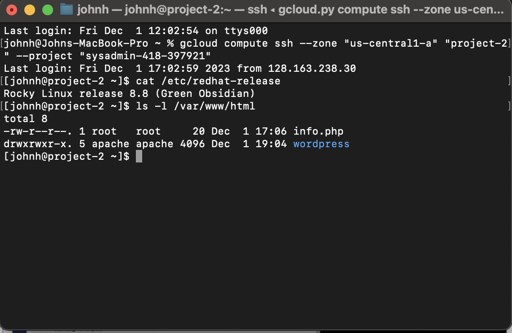
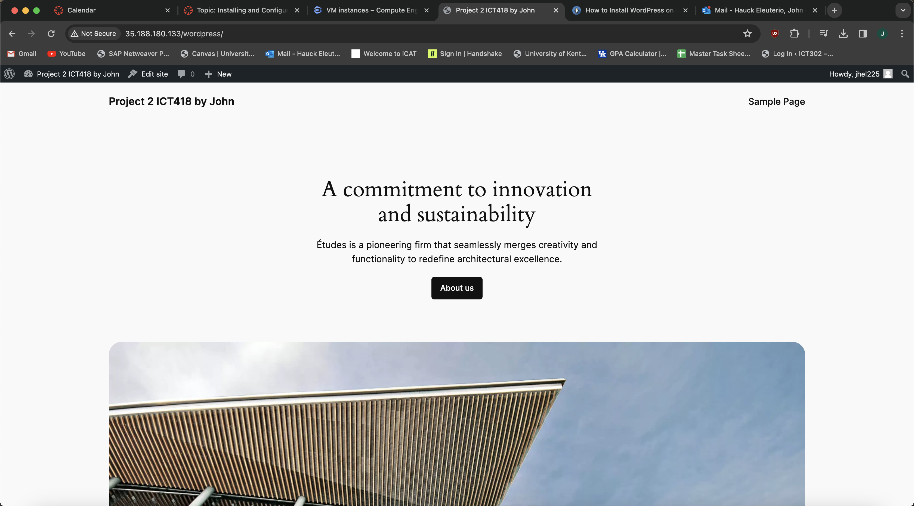
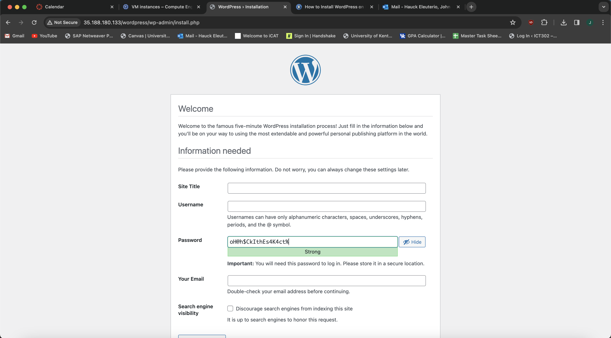

## Steps and commands 
I followed the instructions and picked Rocky Linux for my new VM instance, created it and connected to my terminal. I named my new instance as project 2. Install appache with sudo dnf install httpd
enable with 

-sudo systemctl enable httpd. start with

-sudo systemctl start httpd

-install MariaDB with 

-sudo dnf install mariadb-server mariadb

-enable MariaDB with 

-sudo systemctl enable --now mariadb

-start maria DB

-sudo systemctl start mariadb

-Install php with 

-sudo dnf module list php

-Install some extemsions with 

-sudo dnf install php-curl php-zipand some more 

-install php-gd php-soap php-intl php-mysqlnd php-pdo php-pecl-zip php-fpm php-opcache php-curl php-zip php-xmlrpc wget

-login to MariaDb

-all steps here are the same as project 1

-CREATE USER 'wordpress_user'@'localhost' IDENTIFIED BY '****';

-FLUSH PRIVILEGES; EXIT;

-Next step is 

-wget https://wordpress.org/latest.tar.gz -O wordpress.tar.gz

-now 

-tar -xvf wordpress.tar.gz

-and 

-sudo cp -R wordpress /var/www/html/

-now 

-sudo chown -R apache:apache /var/www/html/wordpress

-now 

-sudo chmod -R 775 /var/www/html/wordpress

## Written 
TO give also a more written and logical explanation on this part, next move is copy the wp-admin-sample.php to wp-admin.php using sudo mv or sudo cp, exactly like we did for project 1. Than I installed naano and did sudo nano wp-admin.php where I fixed the ‘database_name_here’ to ‘wordpress_db’ and also of course change ‘username_here’ to ‘wordpress_user’ and finally set my password, press crtl ^ O to save and Crtz^ X to exit. I also used sudo semanage fcontext -a -t httpd_sys_rw_content_t "/var/www/html/wordpress(/.*)?"  to configure the SELinux context for the directory and its contents and also sudo restorecon -Rv /var/www/html/wordpress to put them to work. With all those commands confirmed to be working, I would resume it by saying, first step is installing Apache, Install MariaDB, Install PHP. Create the database, install php extensions, use the wget command and your wordpress site will be up and running on Rocky Linux. It is important to mention it will only work with a E2-Medium VM since the VM will crash if less than 4gb of RAM are available for the VM. This should be the final output.

## Images

