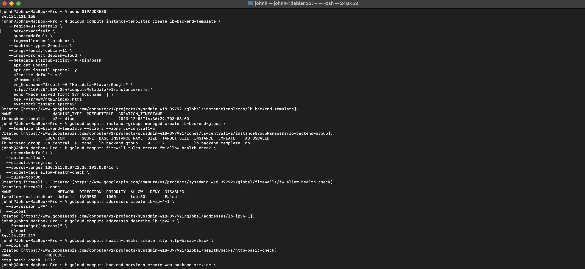

## Written 
As you can see as I started by trying the general gcloud commands as a test and created a debian23 VM just to see if everything was working and also to practice. It all worked but I did encounter some problems with the region and zone. Barely did I know it was the beggining of a huge problem hahahahaha. Follows screenshot of Gcloud with both fall23 and debian23

Then I proceed to create www1 wwww2 and www3 and follow the commands, the only problems I encounter was an error with the Zone and Region variable that would return error permission denied on localtions/zone as I created www1 so for the rest of the development I had to type us-central1 instead of Region and us-central1-a instead of Zone in every single command, what helped me to make zero mistakes along the process. I had to run 'brew install jq' that was not a big deal to be honest. Everything ran smootly, I learned a lot from this project and this class in general. I am syper grateful, as you can see in the c1 to c5 png images, all commands work and were hand typed by me as I learned and followed instructions. The last ss png image is my gcloud console Vm's all healthy and running also my load balance worked perfectly. I will now go ahead and delete all VMS so I save some money for xmas. Thank you so Much Dr. Burns.

## Images

